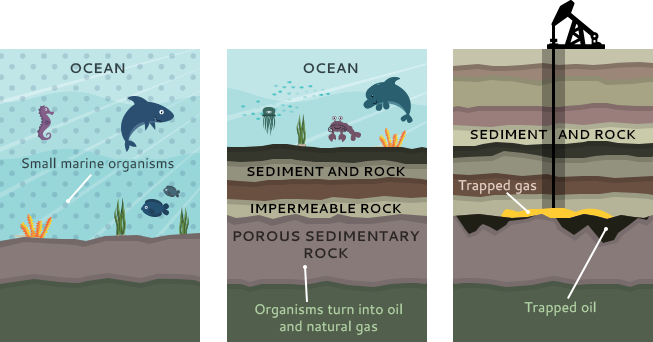

# How Natural Gas is Formed
Millions of years ago, the remains of plants and animals decayed and built up in thick
layers. This decayed matter from plants and animals is called organic material –a compound
that capable of decay or sometime refers as a compound consists mainly carbon. Over time, 
the mud and soil changed to rock, covered the organic material and trapped it beneath the
rock. Pressure and heat changed some of this organic material into coal, some into oil
(petroleum), and some into natural gas – tiny bubbles of odorless gas. The main ingredient
in natural gas is methane, a gas (or compound) composed of one carbon atom and four
hydrogen atoms, CH4 . It is colorless, shapeless, and odorless in its pure form.
In some places, gas escapes from small gaps in the microscopic plants and animals living in
the ocean rocks into the air; then, if there is enough activation energy from lightning or a
fire, it burns. When people first saw the flames, they experimented with them and learned
they could use them for heat and light. The formation of natural gas can be explained
starting with microscopic plants and animals living in the ocean.

The process began in amillions of years ago, when microscopic plants and animals living in
the ocean absorbed energy from the sun, which was stored as carbon molecules in their
bodies. When they died, they sank to the bottom of the sea. Over millions of years, layer
after layer of sediment and other plants and bacteria were formed.
As they became buried ever deeper, heat and pressure began to rise. The amount of pressure
and the degree of heat, along with the type of biomass (biological materials derived from
living organisms), determined if the material became oil or natural gas. More heat produced
lighter oil. At higher heat or biomass made predominantly of plant material produced
natural gas.
After oil and natural gas were formed, they tended to migrate through tiny pores in the
surrounding rock. Some oil and natural gas migrated all the way to the surface and escaped.
Other oil and natural gas deposits migrated until they were caught under impermeable
layers of rock or clay where they were trapped. These trapped deposits are where we find
oil and natural gas wells today where drilling process was conducted to obtain the gas.
In a modern technology, machines called "digesters" is used to turn today's organic material
(plants, animal wastes, etc.) into synthetic natural gas (SNG). This replaces waiting for
thousands of years for the gas to form naturally and could overcome the depletion of
natural resources. The conventional route for SNG production is based on gasification of
biomass to produce synthesis gas and then the subsequent methanation of the synthesis gas
turn it to synthesis natural gas. Woody biomass contain 49.0% carbon and 5.7% hydrogen
that can be converted to 76.8% methane, CH4. 

